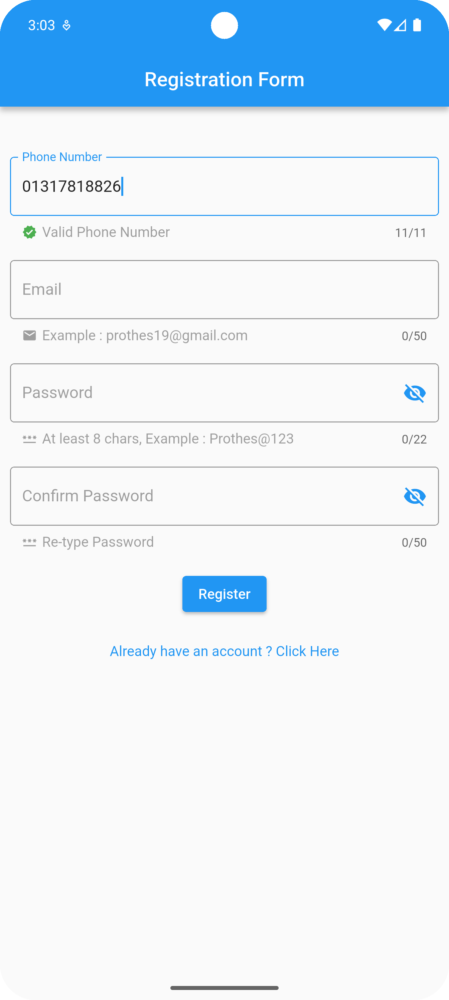

# 📧 Email Authentication with Firebase

A simple **Email & Password Authentication** system for Flutter using **Firebase Authentication**. This project allows users to **register, login, and logout** securely with their email credentials.

---

## 🚀 Features

- ✅ **Email & Password Registration**
- ✅ **Secure Login**
- ✅ **Forgot Password Functionality**
- ✅ **Firebase Integration**
- ✅ **Real-time Authentication Feedback**
- ✅ **User-friendly UI**
- 🌟 **Easily Customizable for Any Flutter Project**

---

## 📸 Screenshots

<table>
  <tr>
    <td></td>
    <td></td>
    <td></td>
    <td></td>
  </tr>
  <tr>
    <td align="center">Login Screen</td>
    <td align="center">Register Screen</td>
    <td align="center">Forgot Password</td>
    <td align="center">Home Screen</td>
  </tr>
</table>


--- 

## 📦 Installation & Setup

1. **Clone the repository**
```bash
   git clone https://github.com/prothesbarai/email_auth_with_firebase.git
```

## 📜 License
- This project is MIT Licensed. See the LICENSE file for details.